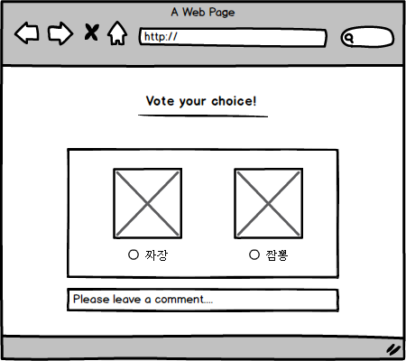

# :woman-kiss-man:

> Node.js 의 Express 프레임워크, pug, mongoDB/mongoose 를 이용해 구현하는 `untitled`!

 

## :memo: Description

Node.js 의 Express 프레임워크를 이용한 데이트 코스 추천 사이트입니다.
카테고리 별로 데이트 코스 후기를 남길 수 있고, 이를 통해 사용자들은 카테고리/지역별 데이트 코스를 공유할 수 있습니다.

## :gear: Function

**계정**

- 계정 관한은 관리자, 사용자가 있습니다.
- 계정은 ID/PASSWORD 와 OAuth 방식을 사용합니다.

**태그**

- 관리자만이 태그 목록을 관리할 수 있습니다.

**게시물**

- 모든 사용자는 게시물을 읽을 수 있고, 로그인 한 사용자는 게시물을 관리(등록/수정/삭제)할 수 있습니다.

**댓글**

- 댓글은 1depth 만 허용합니다.
- 로그인 한 사용자는 댓글을 작성할 수 있습니다.

## :page_with_curl: Page

**계정**

- 로그인 : `GET /auth`
- 회원가입 : `GET /users`

**태그(관리자)**

- 태그 등록 : `GET /admin/tag`
- 태그 목록 : `GET /admin/tag/list`

**게시물**

- 게시물 목록 : `GET /post/list`
- 게시물 상세 : `GET /post/:post_id`

## :page_facing_up: API

**계정**

- 로그인 요청 : `POST /auth`
- 로그아웃 : `DELETE /users`
- 회원가입 요청 : `POST /users`

**태그(관리자)**

- 태그 등록 : `POST /admin/tag`
- 태그 수정 : `PATCH /admin/tag`
- 태그 삭제 : `DELETE /admin/tag`

**게시물**

- 게시물 등록 : `POST /post`
- 게시물 수정 : `PATCH /post`
- 게시물 삭제 : `DELETE /post`

**댓글**

- 댓글 등록 : `POST /comment`
- 댓글 수정 : `PATCH /comment`
- 댓글 삭제 : `DELETE /comment`

## :desktop_computer: DataBase Structure

**User Collection**

| 고유값 | 아이디  |   이름    |   비밀번호    |   권한    |   가입경로    |
| :----: | :-----: | :-------: | :-----------: | :-------: | :-----------: |
|  \_id  | user_id | user_name | user_password | user_auth | auth_provider |

**Tag Collection**

| 고유값 |  태그명  |  작성자   |   작성일    |  수정자   |   수정일    |
| :----: | :------: | :-------: | :---------: | :-------: | :---------: |
|  \_id  | tag_name | create_id | create_date | update_id | update_date |

**Post Collection**

| 고유값 |    상호명     |    지역     |    상세주소    |   카테고리    |     내용      |    별점     |   해시태그   |  작성자   |   작성일    |  수정자   | 수정일      |
| :----: | :-----------: | :---------: | :------------: | :-----------: | :-----------: | :---------: | :----------: | :-------: | :---------: | :-------: | ----------- |
|  \_id  | business_name | region_info | detail_address | post_category | post_contents | star_rating | hashtag_list | create_id | create_date | update_id | update_date |

**Comment Collection**

| 고유값 |      내용       |  작성자   |   작성일    |  수정자   |   수정일    |
| :----: | :-------------: | :-------: | :---------: | :-------: | :---------: |
|  \_id  | comment_content | create_id | create_date | update_id | update_date |
