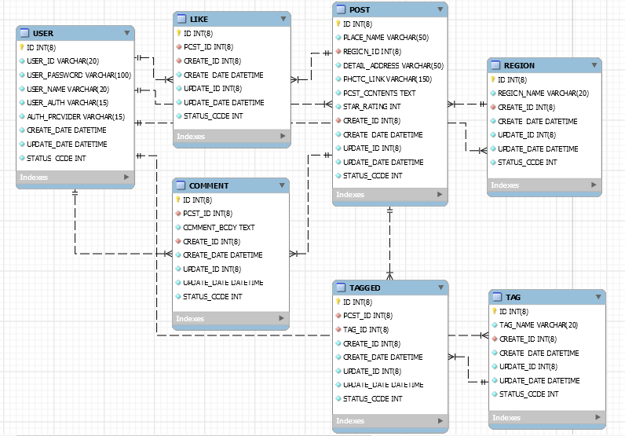

# :eyes: 여기어땠!

> [데모링크](https://how-about-here.herokuapp.com)

> [master branch](https://github.com/mukeunzi/How-About-Here) - Node.js 의 Express 프레임워크, pug, MySQL/sequelize 를 이용해 구현하는 여기어땠!

> [mongodb branch](https://github.com/mukeunzi/How-About-Here/tree/mongodb) - Node.js 의 Express 프레임워크, pug, MongoDB/mongoose 를 이용해 구현하는 여기어땠!

> MongoDB에서 MySQL로 migration 진행 중.

## :memo: Description

여기어땠은 **데이트 장소에 대한 후기를 공유할 수 있는 서비스**입니다.

:one: 연인과의 데이트 장소를 고민하는 사람들  
:two: 반복되는 데이트 코스에 변화를 필요로하는 사람들

을 위해 만들어졌으며, 만족했던 데이트 장소를 공유함으로서 데이트 장소에 대한 후기와 다양한 정보를 얻을 수 있는 서비스입니다.
과도한 해시태그 남발을 방지하기 위해 관리자만이 해시태그를 등록할 수 있도록 했고, 지도 API를 이용하여 장소를 게시물의 제목으로 함으로써 같은 장소의 게시물들을 모아볼 수 있습니다.
사용자는 연인과의 데이트 장소 후기를 작성할 수 있고, 이를 통해 지역별/해시태그 별로 데이트 장소를 공유할 수 있습니다.

## :gear: Function

**계정**

- 계정 관한은 관리자, 사용자가 있습니다.
- 계정은 ID/PASSWORD 와 OAuth 방식을 사용합니다.

**카테고리**

- 관리자만이 지역, 태그 목록을 관리할 수 있습니다.

**게시물**

- 모든 사용자는 게시물을 읽을 수 있고, 로그인 한 사용자는 게시물 업로드 및 댓글을 작성할 수 있습니다.

**댓글**

- 댓글은 1depth 만 허용합니다.
- 로그인 한 사용자는 댓글을 작성할 수 있습니다.

## :page_with_curl: Page URL

**계정**

- Local 로그인 : `GET /auth`
- Google 로그인 : `GET /auth/google-login`
- 회원가입 : `GET /users`

**관리자**

- 관리자 메인 : `GET /admin`
- 지역 목록: `GET /admin/region`
- 태그 목록 : `GET /admin/tag`

**메인**

- 메인 : `GET /`

**게시물**

- 게시물 작성 : `GET /post`
- 게시물 상세 : `GET /post/:post_id`
- 게시물 수정 : `GET /post/edit/:post_id`
- 게시물 목록 : `GET /post/list`

## :page_facing_up: API

**계정**

- 로그인 : `POST /auth`
- 로그아웃 : `POST /auth/logout`
- 회원가입 : `POST /users`

**관리자**

- 지역 등록 : `POST /admin/region`
- 지역 삭제 : `DELETE /admin/region`
- 태그 등록 : `POST /admin/tag`
- 태그 삭제 : `DELETE /admin/tag`

**메인**

- 지역/태그 검색 : `GET /search`

**게시물**

- 게시물 등록 : `POST /post`
- 게시물 수정 : `PATCH /post/:post_id`
- 게시물 삭제 : `DELETE /post/:post_id`

- 댓글 등록 : `POST /comment/:post_id`
- 댓글 삭제 : `DELETE /comment/:comment_id`

- 좋아요 등록 : `POST /post/like/:post_id`
- 좋아요 삭제 : `DELETE /post/like/:post_id`

## :desktop_computer: DataBase Structure

**ERD**

**USER Table**

| 고유값(PK) | 아이디  |   비밀번호    |   이름    |   권한    |   가입경로    |   작성일    |   수정일    | 상태코드    |
| :--------: | :-----: | :-----------: | :-------: | :-------: | :-----------: | :---------: | :---------: | ----------- |
|     ID     | USER_ID | USER_PASSWORD | USER_NAME | USER_AUTH | AUTH_PROVIDER | CREATE_DATE | UPDATE_DATE | STATUS_CODE |

**POST Table**

| 고유값(PK) | 제목(장소) | 지역(FK)  |    상세주소    |  첨부파일  |     내용      |    별점     | 작성자(FK) |   작성일    |  수정자   |   수정일    |  상태코드   |
| :--------: | :--------: | :-------: | :------------: | :--------: | :-----------: | :---------: | :--------: | :---------: | :-------: | :---------: | :---------: |
|     ID     | PLACE_NAME | REGION_ID | DETAIL_ADDRESS | PHOTO_LINK | POST_CONTENTS | STAR_RATING | CREATE_ID  | CREATE_DATE | UPDATE_ID | UPDATE_DATE | STATUS_CODE |

**LIKE Table**

| 고유값(PK) | 게시물(FK) | 작성자(FK) |   작성일    |  수정자   |   수정일    |  상태코드   |
| :--------: | :--------: | :--------: | :---------: | :-------: | :---------: | :---------: |
|     ID     |  POST_ID   | CREATE_ID  | CREATE_DATE | UPDATE_ID | UPDATE_DATE | STATUS_CODE |

**COMMENT Table**

| 고유값(PK) | 게시물(FK) |     내용     | 작성자(FK) |   작성일    |  수정자   |   수정일    |  상태코드   |
| :--------: | :--------: | :----------: | :--------: | :---------: | :-------: | :---------: | :---------: |
|     ID     |  POST_ID   | COMMENT_BODY | CREATE_ID  | CREATE_DATE | UPDATE_ID | UPDATE_DATE | STATUS_CODE |

**REGION Table**

| 고유값(PK) |   지역명    | 작성자(FK) |   작성일    |  수정자   |   수정일    |  상태코드   |
| :--------: | :---------: | :--------: | :---------: | :-------: | :---------: | :---------: |
|     ID     | REGION_NAME | CREATE_ID  | CREATE_DATE | UPDATE_ID | UPDATE_DATE | STATUS_CODE |

**TAG Table**

| 고유값(PK) |  태그명  | 작성자(FK) |   작성일    |  수정자   |   수정일    |  상태코드   |
| :--------: | :------: | :--------: | :---------: | :-------: | :---------: | :---------: |
|     ID     | TAG_NAME | CREATE_ID  | CREATE_DATE | UPDATE_ID | UPDATE_DATE | STATUS_CODE |

**TAGGED Table**

| 고유값(PK) | 게시물(FK) | 태그(FK) |  작성자   |   작성일    |  수정자   |   수정일    | 상태코드    |
| :--------: | :--------: | :------: | :-------: | :---------: | :-------: | :---------: | ----------- |
|     ID     |  POST_ID   |  TAG_ID  | CREATE_ID | CREATE_DATE | UPDATE_ID | UPDATE_DATE | STATUS_CODE |
